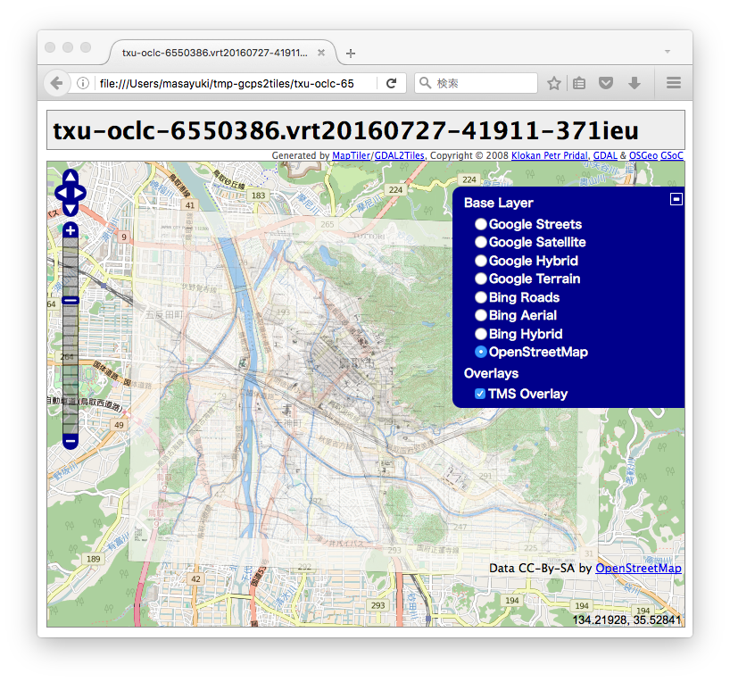

[](https://rubygems.org/gems/gcps2tiles)

# gcps2tiles

A generator of TMS (Tile Map Service) tiles from a image and its GCPs (Ground Control Points).

## Installation

```bash
$ gem install gcps2tiles
```

### Dependencies

1. `gdal_translate`
2. `gdal2tiles.py`

These command-line tools are executed by `systemu` or `open3` from `gcps2tiles`.

### Example for Instllation

* macOS
* macPorts
* RubyGems

```bash
# for gdal_translate
$ sudo port install gdal
$ which -a gdal_translate
/opt/local/bin/gdal_translate

# for gdal2tiles.py
$ sudo port install py27-gdal
$ which /opt/local/share/doc/py27-gdal/examples/scripts/gdal2tiles.py
/opt/local/share/doc/py27-gdal/examples/scripts/gdal2tiles.py

# for gcps2tiles
$ sudo port install proj
$ gem install proj4rb -- --with-opt-include=/opt/local/include --with-opt-lib=/opt/local/lib
$ gem install gcps2tiles
$ which gcps2tiles 
/Users/masayuki/.rbenv/shims/gcps2tiles
```

## Usage

```bash
# run help of gcps2tiles
$ gcps2tiles help
Commands:
  gcps2tiles generate --gcps-file-path=GCPS_FILE_PATH --image-file-path=IMAGE_FILE_PATH  # generator TMS (Tile Map Service) tiles from a image and its GCPs (Ground Control Points) 
  gcps2tiles help [COMMAND]                                                              # Describe available commands or one specific command

Options:
  [--gdal-translate-path=GDAL_TRANSLATE_PATH]  
                                               # Default: gdal_translate
  [--python-path=PYTHON_PATH]                  
                                               # Default: python
  [--gdal2tiles-path=GDAL2TILES_PATH]          
                                               # Default: gdal2tiles.py
```

### Example for Usage

The command `ls` displays a raster image and its gcps points file. The `txu-oclc-6550386.jpg` is download from http://www.lib.utexas.edu/maps/ams/japan_city_plans/. The image's URL is http://www.lib.utexas.edu/maps/ams/japan_city_plans/txu-oclc-6550386.jpg. The `txu-oclc-6550386.points` is generated from the image by hand work with [QGIS's Georeferencer GDAL Plugin](http://docs.qgis.org/2.0/en/docs/user_manual/plugins/plugins_georeferencer.html).

```bash
$ ls
txu-oclc-6550386.jpg    txu-oclc-6550386.points
```

The command `cat` displays the content of `txu-oclc-6550386.points`.

```bash
$ cat txu-oclc-6550386.points 
mapX,mapY,pixelX,pixelY,enable
14942011.24356307648122311,4231785.85050928499549627,1933.549259681095009,-1827.33727220956689052,1
14942204.06600598804652691,4231988.44545324612408876,2026.88463391136860992,-1723.68220134874627547,1
14942476.045682268217206,4231792.49753643479198217,2154.75512528474064311,-1818.79513097949893563,1
14940591.59045474231243134,4232046.88148782681673765,1223.80780346820824889,-1725.78961946050026199,1
14939983.62762918882071972,4233524.63498547300696373,913.52901740949482701,-991.62939136701231746,1
14939850.02285714447498322,4233210.41635492164641619,838.98519306166406295,-1146.04159894466192782,1
14938191.42381835728883743,4235546.01964407879859209,0,0,1
14948244.77059711329638958,4235127.56189436092972755,5000,0,1
14948112.61969627812504768,4227568.21257229428738356,5000,-3841,1
14938057.33083977922797203,4227986.65016794484108686,0,-3840.99765173410287389,1
```

The command `gcps2tiles` generates TMS (Tile Map Service) tiles from `txu-oclc-6550386.jpg` and `txu-oclc-6550386.points` into the directory `txu-oclc-6550386`.

```bash
$ gcps2tiles generate --gcps-file-path=txu-oclc-6550386.points --image-file-path=txu-oclc-6550386.jpg --output-dir-path txu-oclc-6550386
$ gdal_translate -of VRT -gcp 1933.549259681095 1827.337272209567 14942011.243563076 4231785.850509285 -gcp 2026.8846339113686 1723.6822013487463 14942204.066005988 4231988.445453246 -gcp 2154.7551252847406 1818.795130979499 14942476.045682268 4231792.497536435 -gcp 1223.8078034682082 1725.7896194605003 14940591.590454742 4232046.881487827 -gcp 913.5290174094948 991.6293913670123 14939983.627629189 4233524.634985473 -gcp 838.9851930616641 1146.041598944662 14939850.022857144 4233210.416354922 -gcp 0.0 -0.0 14938191.423818357 4235546.019644079 -gcp 5000.0 -0.0 14948244.770597113 4235127.561894361 -gcp 5000.0 3841.0 14948112.619696278 4227568.212572294 -gcp 0.0 3840.997651734103 14938057.33083978 4227986.650167945 txu-oclc-6550386.jpg /var/folders/cc/470s1lj92dx_7z9ykv36kt0m0000gn/T/txu-oclc-6550386.vrt20160727-40569-n8ta9b
$ python gdal2tiles.py --s_srs epsg:3857 /var/folders/cc/470s1lj92dx_7z9ykv36kt0m0000gn/T/txu-oclc-6550386.vrt20160727-40569-n8ta9b 
python: can't open file 'gdal2tiles.py': [Errno 2] No such file or directory
#<Process::Waiter:0x007fed4d896d30 dead>
#<Process::Status: pid 40599 exit 2>
```

To remove the error `python: can't open file 'gdal2tiles.py': [Errno 2] No such file or directory`, you can set a path to the command-line tool.

```bash
$ gcps2tiles generate --gcps-file-path=txu-oclc-6550386.points --image-file-path=txu-oclc-6550386.jpg --output-dir-path txu-oclc-6550386 --gdal2tiles-path=/opt/local/share/doc/py27-gdal/examples/scripts/gdal2tiles.py
run gdal_translate -of VRT -gcp 1933.549259681095 1827.337272209567 14942011.243563076 4231785.850509285 -gcp 2026.8846339113686 1723.6822013487463 14942204.066005988 4231988.445453246 -gcp 2154.7551252847406 1818.795130979499 14942476.045682268 4231792.497536435 -gcp 1223.8078034682082 1725.7896194605003 14940591.590454742 4232046.881487827 -gcp 913.5290174094948 991.6293913670123 14939983.627629189 4233524.634985473 -gcp 838.9851930616641 1146.041598944662 14939850.022857144 4233210.416354922 -gcp 0.0 -0.0 14938191.423818357 4235546.019644079 -gcp 5000.0 -0.0 14948244.770597113 4235127.561894361 -gcp 5000.0 3841.0 14948112.619696278 4227568.212572294 -gcp 0.0 3840.997651734103 14938057.33083978 4227986.650167945 txu-oclc-6550386.jpg /var/folders/cc/470s1lj92dx_7z9ykv36kt0m0000gn/T/txu-oclc-6550386.vrt20160727-41911-371ieu
run python /opt/local/share/doc/py27-gdal/examples/scripts/gdal2tiles.py --s_srs epsg:3857 /var/folders/cc/470s1lj92dx_7z9ykv36kt0m0000gn/T/txu-oclc-6550386.vrt20160727-41911-371ieu txu-oclc-6550386
Generating Base Tiles:
0...10...20...30...40...50...60...70...80...90...100 - done.
Generating Overview Tiles:
0...10...20...30...40...50...60...70...80...90...100 - done.
```

Tips: The options for a path to a command-line tool as is follows:

* `--gdal-translate-path=GDAL_TRANSLATE_PATH]` # Default: gdal_translate
* `--gdal2tiles-path=GDAL2TILES_PATH]` # Default: gdal2tiles.py
* `--python-path=PYTHON_PATH]` # Default: python

```bash
$ tree txu-oclc-6550386 -L 1
txu-oclc-6550386
├── 11
├── 12
├── 13
├── 14
├── 15
├── 16
├── googlemaps.html
├── openlayers.html
└── tilemapresource.xml

6 directories, 3 files
$ du -sh txu-oclc-6550386.jpg 
4.0M	txu-oclc-6550386.jpg
$ du -sh txu-oclc-6550386
 28M	txu-oclc-6550386
```

To show TMS tiles which generated by `gdal2tiles.py`.

```bash
$ open txu-oclc-6550386/openlayers.html
```



## Development

After checking out the repo, run `bin/setup` to install dependencies. Then, run `rake spec` to run the tests. You can also run `bin/console` for an interactive prompt that will allow you to experiment.

To install this gem onto your local machine, run `bundle exec rake install`. To release a new version, update the version number in `version.rb`, and then run `bundle exec rake release`, which will create a git tag for the version, push git commits and tags, and push the `.gem` file to [rubygems.org](https://rubygems.org).
